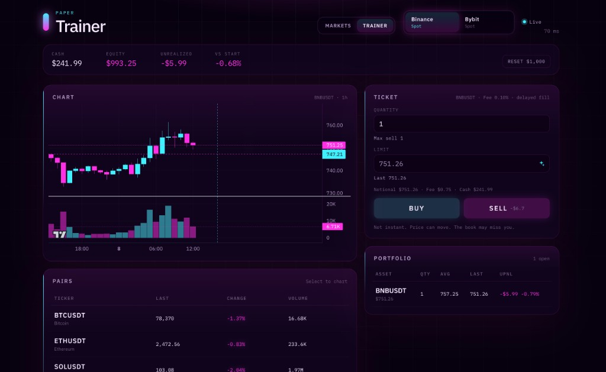

# PAPER Trainer

Paper-trade live spot markets without an API key and without real money. Quotes and candles come from Binance and Bybit. Fills are simulated on your machine.

[](https://github.com/DenQ/live-spot-dashboard/actions/workflows/deploy.yml)
[](https://github.com/DenQ/live-spot-dashboard/actions/workflows/deploy.yml)
[](https://denq.github.io/live-spot-dashboard/)

**[Live demo](https://denq.github.io/live-spot-dashboard/)** · [Guide (English)](docs/guide.md) · [Инструкция (русский)](docs/guide.ru.md)

<p align="center">
  
</p>

## Why it exists

A professional-looking trainer for rehearsing entries and exits on real prices. You get a live tape, a ticket that is not instant, and a portfolio you can reset. Nothing hits an exchange.

## What you get

- **Markets** and **Trainer** — watch the book, then place paper orders on the same live feed
- **Binance Spot** and **Bybit Spot** — public REST + WebSocket, no credentials
- **Live status** with latency (RTT) when the socket is healthy
- **Candlestick chart** and a watchlist (BTC, ETH, SOL, BNB, XRP, DOGE)
- **Order ticket** — quantity or amount (USD), limit, 0.10% fee, cash, max sell, and All cash
- **Realistic matching** — delayed fills, slippage, and a chance the book misses you
- **Account strip** — cash, equity, unrealized PnL, vs start, **Reset $1,000**
- **Portfolio, open orders, ledger** — persisted in the browser

## Quick start

```bash
npm ci
npm run dev
```

Open the URL Vite prints (usually `http://localhost:5173`). Use **Trainer** to trade.

```bash
npm test          # Vitest
npm run test:e2e  # Playwright (install Chromium once: npx playwright install chromium)
```

Full setup, paper rules, and GitHub Pages: **[English guide](docs/guide.md)** · **[Русская инструкция](docs/guide.ru.md)**

## Stack

React 19, TypeScript, Vite, Feature-Sliced Design, [lightweight-charts](https://github.com/tradingview/lightweight-charts).

## Disclaimer

This is a local simulation. Starting cash is $1,000. Orders are not sent to an exchange. Price can move while an order is working; the simulated book may miss you. Not financial advice.
